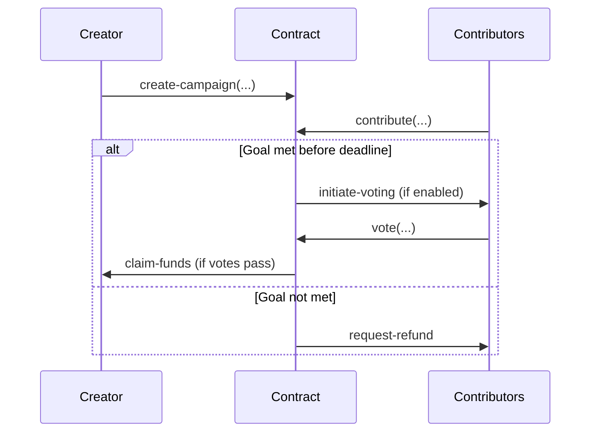

# BitStackFund

**BitStackFund** is a decentralized crowdfunding protocol built on the [Stacks blockchain](https://www.stacks.co/) and secured by Bitcoin. It enables trustless campaign creation, contributor governance, and transparent STX fund management with Bitcoin-grade finality.

---

## 🌟 Features

* **🔒 Bitcoin-Secured Infrastructure**
  Uses the Stacks blockchain for smart contracts, inheriting Bitcoin’s finality and security.

* **🧰 Flexible Campaigns**
  Set custom parameters: funding goal, duration, minimum contribution, and optional governance.

* **🗳️ Contributor Governance**
  Contributors gain voting power proportional to their STX contributions. Governance determines whether the creator can access the funds.

* **🤖 Automated Fund Handling**

  * Escrow-based STX management
  * Auto-refunds for failed campaigns
  * Platform fee (default: 2.5%) on successful campaigns

* **🛡️ Anti-Abuse Mechanisms**

  * Minimum contribution enforcement
  * Emergency admin pause
  * Creator/admin campaign cancellation

---

## 🧠 Architecture Overview

### Smart Contract Components

```
BitStackFund.clar
├── Constants & Errors
├── Campaign Storage
├── Contribution Tracking
├── Voting & Governance
├── Admin & Platform Controls
└── Escrow Logic
```

### Key Data Structures

```clarity
(struct Campaign
  (creator principal)
  (goal uint)
  (raised uint)
  (deadline-height uint)
  (voting-enabled bool)
  (votes-for uint)
  (votes-against uint)
  (status uint)) ;; 0: ACTIVE, 1: SUCCESS, 2: FAILED, 3: CANCELLED

(struct Contribution
  (amount uint)
  (refunded bool)
  (voting-power uint))
```

---

## 🔁 Workflow



---

## 🧪 Usage Guide

### Prerequisites

* [Stacks CLI](https://docs.stacks.co/cli-reference) v3.0+
* Node.js v18.x+
* STX testnet tokens
* [Clarinet](https://github.com/hirosystems/clarinet) for local dev

---

## 📝 Smart Contract Interface

| Function                   | Description                     | Access        |
| -------------------------- | ------------------------------- | ------------- |
| `create-campaign`          | Initialize new campaign         | Public        |
| `contribute`               | Fund an active campaign         | Public        |
| `vote`                     | Cast vote on fund release       | Contributor   |
| `claim-funds`              | Withdraw raised funds           | Creator       |
| `request-refund`           | Refund contribution (if failed) | Contributor   |
| `cancel-campaign`          | Cancel an active campaign       | Creator/Admin |
| `set-platform-fee-rate`    | Adjust platform fee (%)         | Admin         |
| `emergency-pause-campaign` | Pause campaign operations       | Admin         |

---

### Sample Calls

**Create a Campaign**

```clarity
(create-campaign
  "Project X"
  "Next-gen decentralized app"
  u1000000  ;; Goal: 1000 STX
  u2016     ;; Duration: ~2 weeks (blocks)
  true      ;; Enable voting
  u432      ;; Voting window: ~3 days
  u100      ;; Minimum contribution: 1 STX
)
```

**Contribute**

```clarity
(contribute u42 u5000) ;; Campaign ID 42, 50 STX
```

**Vote**

```clarity
(vote u42 true) ;; Vote to release funds
```

**Claim Funds**

```clarity
(claim-funds u42)
```

**Request Refund**

```clarity
(request-refund u42)
```

---

## 🧷 Security Design

* **Escrow Enforcement**
  Funds are time-locked until campaign success and vote approval (if enabled).

* **Input Validation**

  ```clarity
  (asserts! (is-valid-string title) ERR_INVALID_STRING)
  (asserts! (> goal u0) ERR_INVALID_PARAMETERS)
  ```

* **Access Control**

  * Creator-only fund claims
  * Admin-only fee updates and campaign pause
  * One-vote-per-user enforcement

* **Testing Strategy**

  * 100% test coverage on core logic
  * Fuzz testing on contribution/voting edge cases
  * Formal logic checks on fund release

---

## 🚀 Deployment

```bash
clarinet check       # Syntax check
clarinet test        # Run unit tests
clarinet deploy      # Deploy to localnet
```

---

## 📍 Roadmap

* 🎖 NFT-based contributor perks
* ⛓ Milestone-based fund unlocking
* 🏛 DAO integration for meta-governance
* 🖥 Web UI for campaign tracking

---

## 🤝 Contributing

We welcome your contributions!

1. Fork this repo
2. Create a feature branch
3. Submit a PR with:

   * Tests
   * Documentation
   * Security rationale

```bash
npm run test:all  # Run full test suite
```
